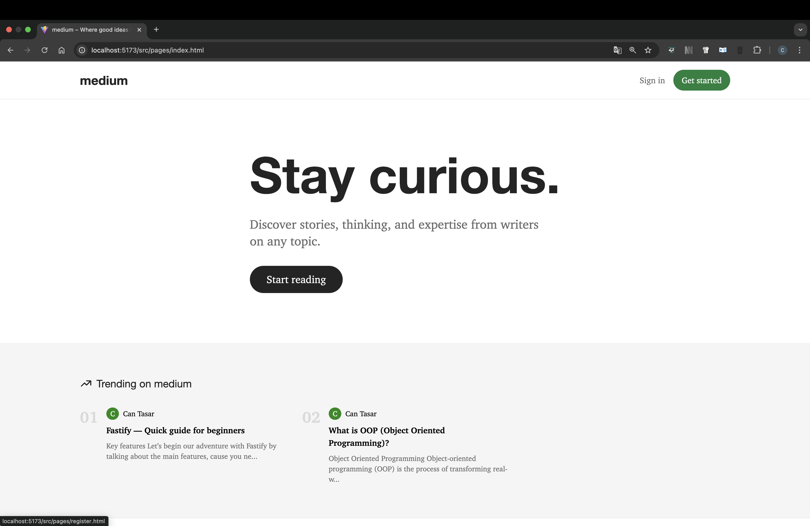
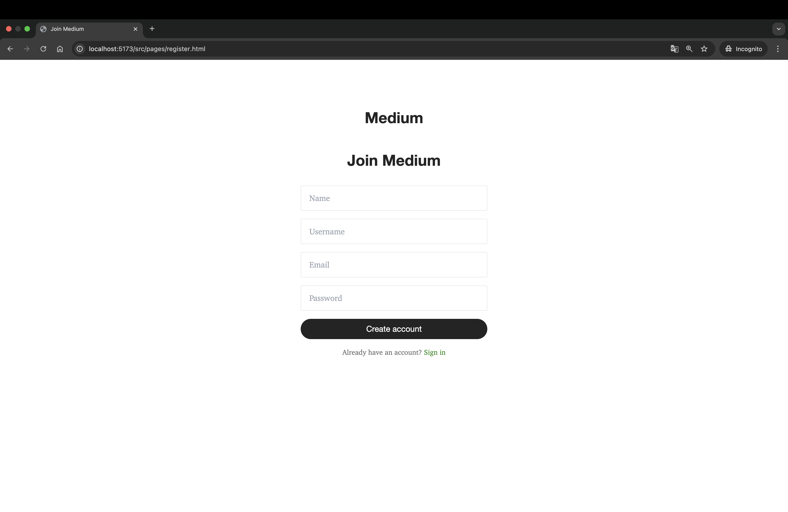
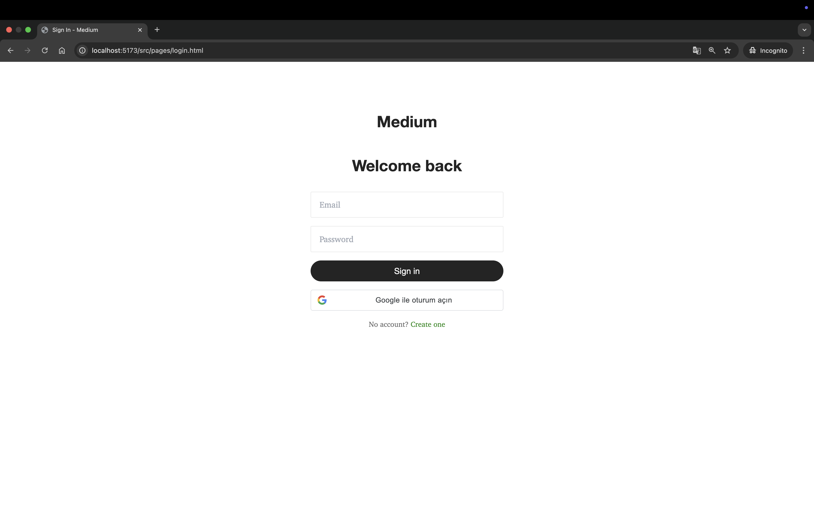
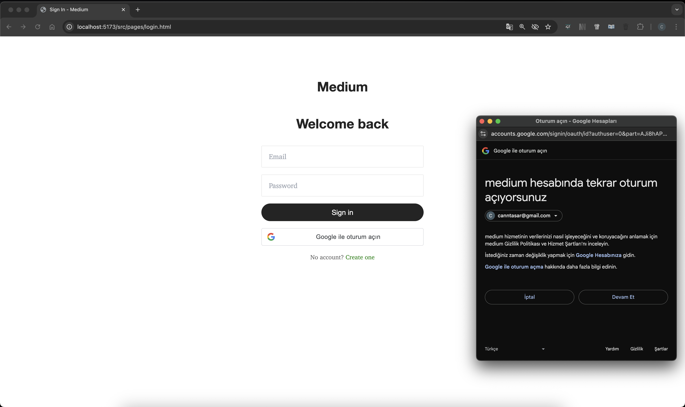
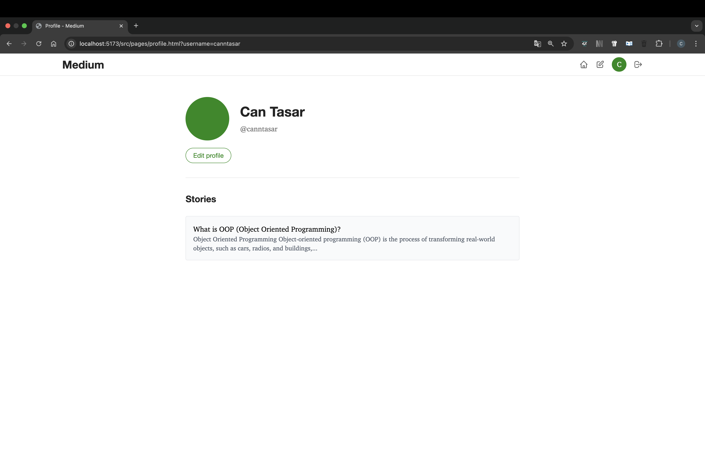
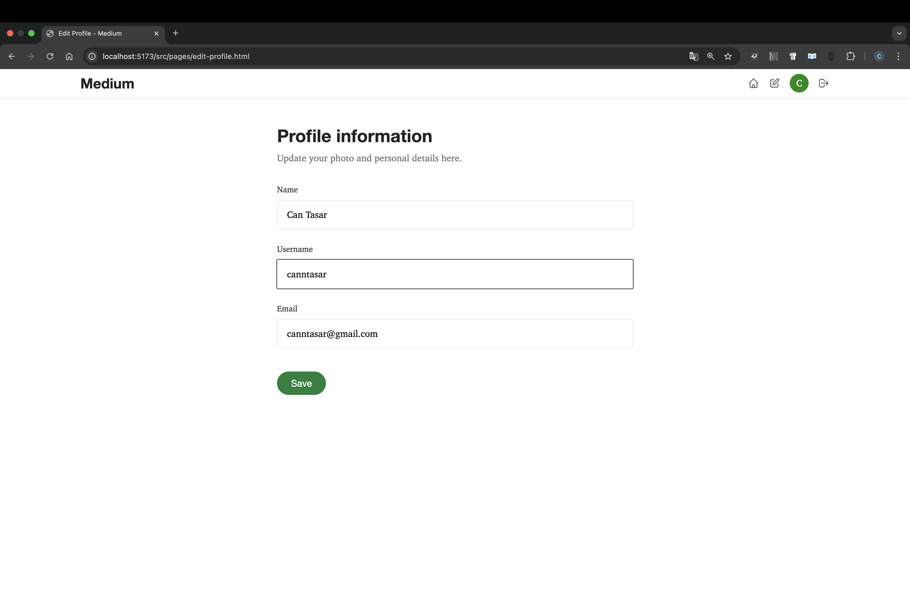
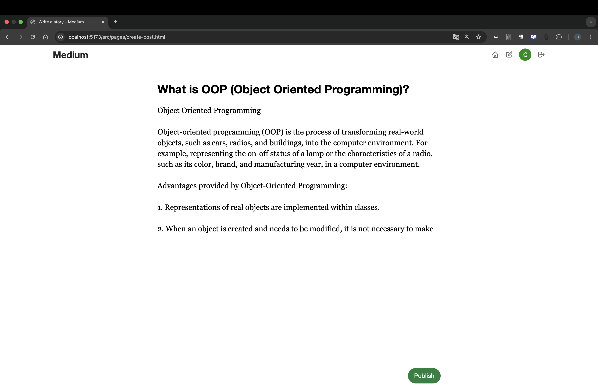
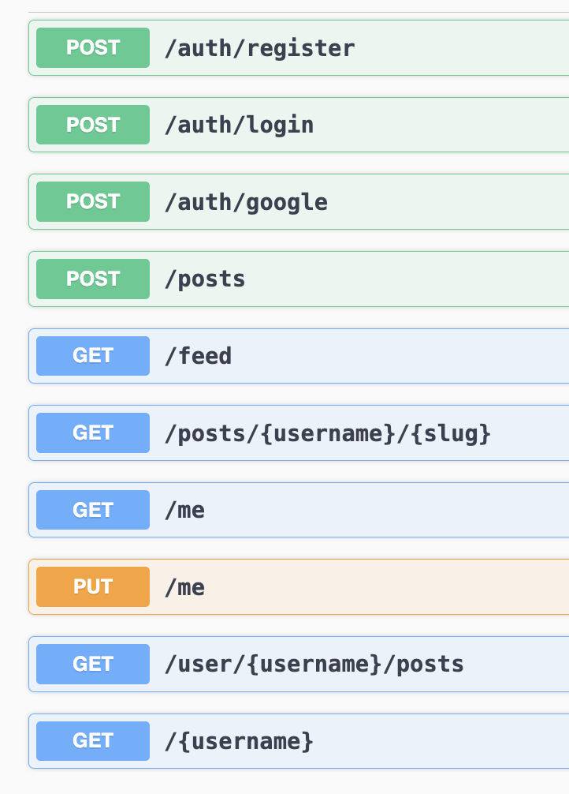

# 📰 Medium Clone – Fullstack Blogging Platform

A full-featured Medium-like blogging platform with complete user authentication, rich article publishing, and a clean developer-oriented tech stack. This project demonstrates how to build a fullstack application from scratch using modern JavaScript tools — including JWT-based auth, Google OAuth integration, and scalable frontend/backend architecture.

---

## 📸 Preview

| Description        | Preview                                                                   |
|--------------------|---------------------------------------------------------------------------|
| Homepage UI        |   |
| Register           |      |
| Login              |            |
| Google Login       |  |
| Profile Page       |  |
| Profile Edit Page  |  |
| Create Post        |  |
| API Docs (Swagger) |      |

---

## 🧩 Features

### 🧑‍💼 User Management
- Email/password-based registration and login
- Google OAuth 2.0 integration
- JWT-based session authentication
- Two-Factor Authentication (2FA) via authenticator apps
- Editable public profile (username, name, email)
- Slug-based profile URLs: `/username`

### 📝 Content Management
- Create, edit, and delete articles
- Articles with SEO-friendly slugs: `/username/article-title-slug`
- Rich text editing support (custom frontend/editor coming)
- View user’s articles from their public profile
- Article feed sorted by latest posts

### 📢 Social Features
- Public author profiles
- Upcoming: Likes, Comments, Follows

### 🔒 Security
- JWT signing and secure token handling
- Password hashing with bcrypt
- Rate limiting sensitive routes
- Input validation and sanitization
- CSRF protection (planned)

---

## ⚙️ Technology Stack

### Backend
- **Language:** Node.js (JavaScript)
- **Framework:** Fastify (minimal, high-performance web framework)
- **Auth:** JWT, Google OAuth 2.0, optional 2FA
- **ORM:** Prisma
- **Database:** SQLite (file-based DB for simplicity)
- **API Docs:** Swagger / OpenAPI
- **Security:** bcrypt, CORS, input validation, rate limiting

### Frontend
- **Language:** TypeScript
- **Build Tool:** Vite
- **Styling:** TailwindCSS (utility-first, responsive)
- **SPA Navigation:** HTML + DOM-based routing (no React/Vue)
- **Auth Integration:** Token storage in `localStorage`, redirect guards

### DevOps
- **Containerization:** Docker & Docker Compose
- **Directory Separation:** Monorepo (`apps/backend`, `apps/frontend`)
- **Live reload:** Supported in both services
- **Environment Configuration:** `.env` files per app

---

## 📁 Project Structure

```bash
medium-clone/
├── apps/
│   ├── backend/              # Fastify backend
│   │   ├── src/
│   │   │   ├── controllers/  # Route handlers
│   │   │   ├── services/     # Business logic
│   │   │   ├── routes/       # Route definitions
│   │   │   ├── middlewares/  # Auth, validation
│   │   │   └── utils/        # Slugify, token, etc.
│   │   └── prisma/           # Prisma schema and migrations
│   └── frontend/             # Vanilla TypeScript frontend
│       ├── src/
│       │   ├── pages/        # HTML views
│       │   ├── scripts/      # Frontend logic
│       │   └── components/   # Header, Footer, etc.
│       └── public/           # Static assets
├── docker/
│   ├── backend.Dockerfile
│   └── frontend.Dockerfile
├── docker-compose.yml
└── README.md
```

---

## 🚀 Getting Started

### 1. Clone the repository
```bash
git clone https://github.com/cantasar/medium-clone.git
cd medium-clone
```

### 2. Setup environment variables

Create the following files manually:

#### `apps/backend/.env`
```
PORT=3000
JWT_SECRET=your_jwt_secret
```


### 3. Install dependencies

#### Backend
```bash
cd apps/backend
npm install
npx prisma migrate dev --name init
npm run dev
```

#### Frontend
```bash
cd apps/frontend
npm install
npm run dev
```

---

## 🐳 Docker Usage

### 🔧 Build and run with Docker Compose

```bash
docker compose up --build
```

This will:
- Build backend & frontend containers
- Start Fastify on port 3000
- Start frontend (Vite dev server) on port 5173
- Auto-run Prisma migrations

### 🔁 Common Docker Commands

```bash
docker compose up -d           # Start in background
docker compose down            # Stop all
docker compose logs -f        # View live logs
docker compose build backend   # Rebuild backend only
docker compose restart frontend
```

---

## 🔐 Authentication Flow

### Email Login
- Credentials submitted → `POST /auth/login`
- Returns JWT if valid → stored in `localStorage`

### Google Sign-In
- Google widget gets `id_token`
- Sent to `POST /auth/google`
- Backend verifies, then returns JWT

### Auth Guards
- Frontend redirects non-authenticated users to `/login.html` if no token found
- Backend protects routes using `verifyToken` middleware

---

## 📚 API Documentation

Available via Swagger when backend is running:

📄 [`http://localhost:3000/docs`](http://localhost:3000/docs)

> Future: Postman collection will be published.

---

## 🧪 Testing (Planned)

- Unit testing with Vitest
- E2E testing with Playwright
- Test coverage reports
- Mocking for external auth (Google)

---

## 🛡 Security Measures

- Bcrypt password hashing
- JWT with expiration and verification
- Token invalidation (optional logout implementation)
- Environment-based secrets
- Rate limiting for sensitive endpoints
- Input validation (manual schema validation)
- CORS protection

---

## 🔄 Upcoming Features

- Profile image upload
- Article tags + search
- Comment system
- Social sharing
- Theme toggle (dark/light mode)
- Progressive enhancement for offline support

---

## 🤝 Contributing

1. Fork this repo
2. Create a new feature branch
3. Commit and push your changes
4. Submit a Pull Request 🚀

---

## 📝 License

Licensed under MIT — feel free to use, modify, and share.

---

## 🙌 Credits & Inspiration

- Inspired by [Medium](https://medium.com/)
- Tech decisions influenced by Fastify, Prisma, and Vite
- UI designed with TailwindCSS for a clean, minimal feel
